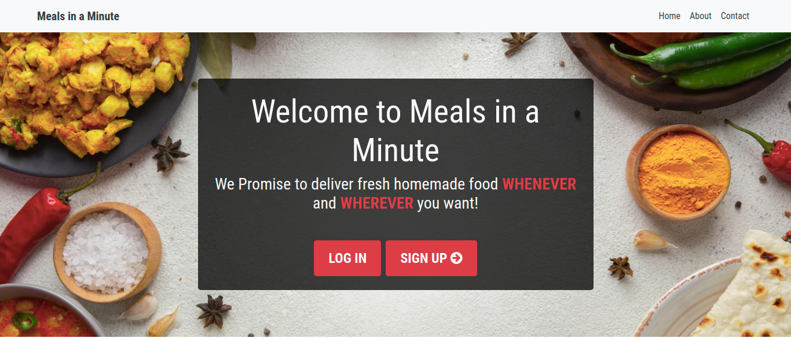
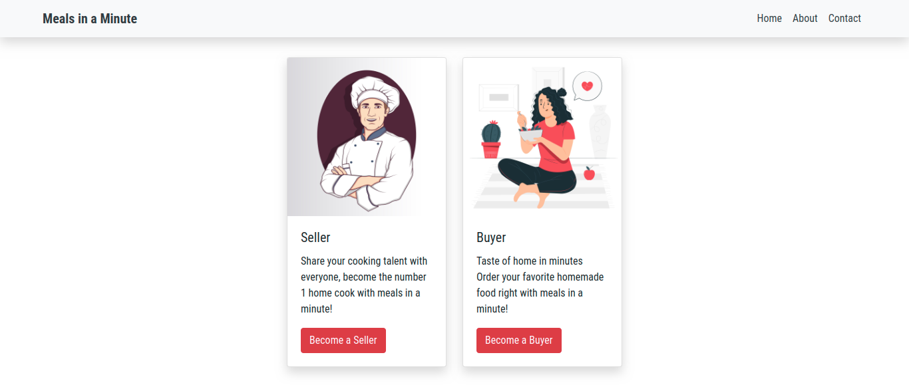
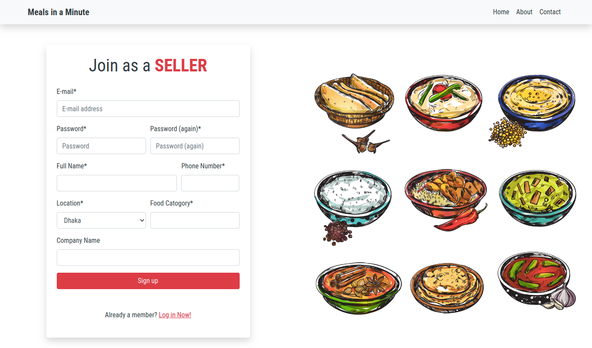
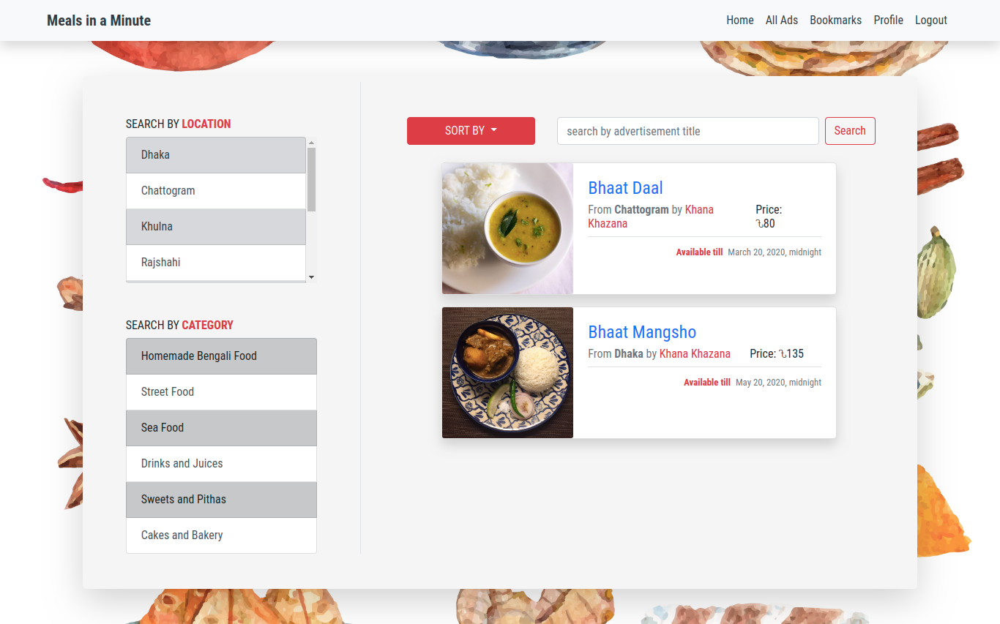
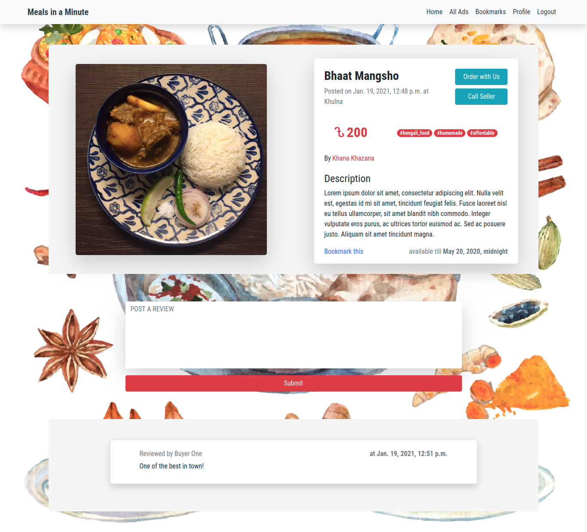
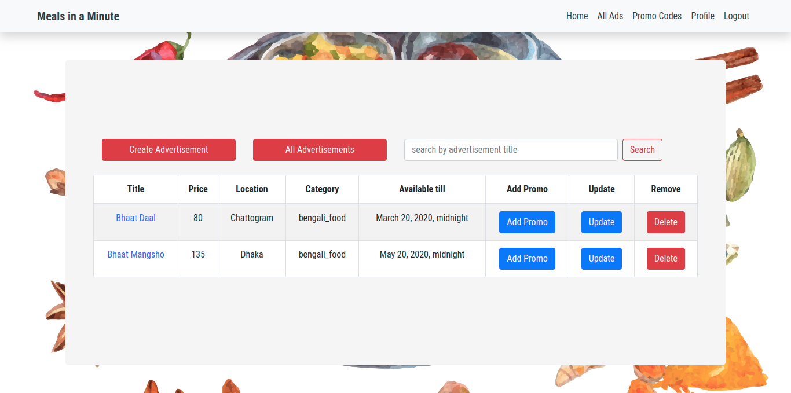

## Meals in a Minute

### System Analysis and Design Lab project using Django, Bootstrap4 and PostgreSQL

Meals in a minute is an online food-selling marketplace where users can sign up to buy/sell food items for free! Some features that I have implemented here are,

- Seller and Buyer entity with separate profile information.
- Option for seller to,
  - CRUD food advertisement with Price, Image, Location etc
  - Add discount to ads using promo code.
  - Review buyer and check other sellers reviews.
  - Change delivery status.
  - Search through own advertisements.
- Option for buyer to,
  - Browse through all ads posted by various sellers.
  - Search ads by location, category and ad title.
  - Sort ads by Price, Availability and Location.
  - Order foods from ads with/without promo codes and view order history and order status.
  - Review ads and sellers check other reviews.
  - Bookmark ads.

### Tech stack

- Django
  - allauth
  - crispy-forms
- PostgreSQL
- Bootstrap4

To run locally,

```bash
git clone https://github.com/amitkbiswas0/meals-in-a-minute.git
cd meals-in-a-minute
python -m venv venv
source venv/bin/activate
pip install -r requirements.txt
```

Then add a .env file with the following values,

```sql
SECRET_KEY, DBNAME, DBHOST, DBPASS, DBUSER
```

Run the project using ,

```
python manage.py runserver
```

## Screenshots

### Landing Page



### Login Page


### Signup Pages




### Buyer Homepage



### Product Page with Review



### Seller Homepage



### Create Advertisement


### Background images and graphics taken from these sources,

- <a href='https://www.freepik.com/vectors/background'>Background vector created by pikisuperstar</a>

- <a href='https://www.freepik.com/vectors/food'>Food vector created by macrovector</a>

- <a href="https://www.freepik.com/free-vector/indian-food-set_9462579.htm#page=1&query=indian%20food&position=4">Food vector created by macrovector</a>

- <a href='https://www.freepik.com/photos/frame'>Frame photo created by freepik</a>
